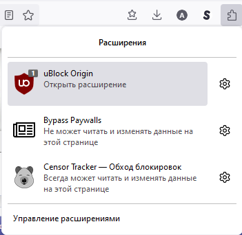
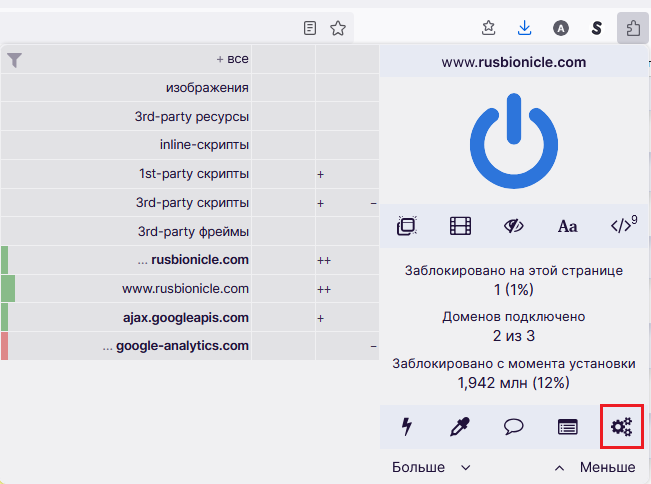
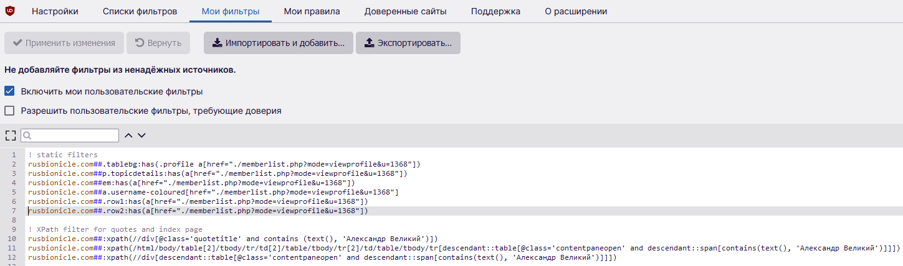

# Полный игнор пользователей Rusbionicle

Вас очень достал *один конкретный юзер*? При этом он, так уж вышло, теперь модер, и его не добавить в недруги? Решение есть, и оно - обычный блокировщик рекламы! Вы ведь пользуетесь блоком рекламы? Если нет, настоятельно рекомендую uBlock Origin, режет ВСЁ, а что не режет - легко заставить резать. И сейчас заставим порезать все упоминания нашего любимого юзера!
1. Откройте панель управления аддона (см. скриншоты).

2. На вкладке "Мои фильтры" нажмите кнопку "Импортировать и добавить" и загрузите файл `my-ublock-static-filters.txt` отсюда. Или просто скопируйте текст из него и вставьте в окно, как показано. Не забудьте нажать "Применить изменения".

3. Готово, вы восхитительны, а надоедливый юзер больше не маячит у вас перед глазами!

P.S. НЕ спасает от бана, если юзер - модератор (или, о ужас, админ). Все изменения исключительно в вашем браузере.
